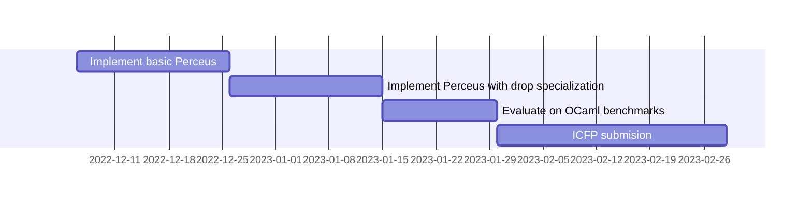

# Status: fall 2022

## Research Goal

Through this project, we wish to replace OCaml's garbage collector with the Perceus reference counting system.

Along the way, we wish to study the following:

- What fundamental changes need to be made to an industrial strength compiler (like that of OCaml) to retro-actively use Perceus for memory management?
- Did we have to deviate from an ideal implementation owing to the structure of the compiler? If so, what was the impact of any design decisions that were made?
- How does the compiled code perform with Perceus?

## Current status

TODO

## Next steps

Now that we have most of the reference counting primitives implemented and benchmarked, we will start implementing the Perceus algorithm to automate the refcount operation insertion. Our goal is to get something substantive working by end of January so that we can work on a submission to ICFP'23.

