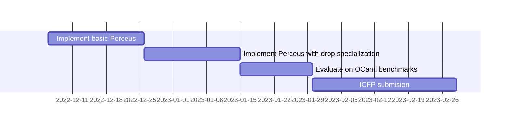

# Status: fall 2022

## Research Goal

Recently, the Koka and Lean languages use novel compiler guided reference counting, called Perceus [1]. Even though good performance
is reported compared with GC'd languages like OCaml, Haskell, and Java, there is no direct evidence that Perceus can be 
competitive with a state-of-the-art garbage collector. In this project we aim to create a new Perceus backend for the OCaml
system to measure the difference between Perceus and GC directly. This is a complex undertaking: OCaml is a large system and
many design choices in the runtime are made to support fast GC and exceptions, sometimes at the detriment for other designs
like Perceus -- in particular with respect to the low-level register calling conventions. 

Important steps along the way are:

1. Implement the basic primitives needed for Perceus. Using these primitives we should be able to manually write small benchmark
   programs and disable the GC -- this will give us an initial baseline of the expected outcomes. This step is already quite involved
   as it involves creating new low level Perceus instructions in the backend of the compiler, changing the fundamental layout of objects
   in the runtime system to support reference counts, and compiling the Perceus instructions into efficient assembly (for x64 only for now).

2. Implement the Perceus transformation in the OCaml compiler, generating the primitive instructions from step 1. Again, this is
   quite involved, needing liveness analysis and basic optimizations like drop-specialization require type information etc. 
   
3. Implement full Perceus including reuse analysis.

4. Be able to run the OCaml benchmark suite.

5. Measure how Perceus does compared to the native GC. 

Along the way, we wish to study the following:

- What fundamental changes need to be made to an industrial strength compiler (like that of OCaml) to retro-actively use Perceus for memory management?
- Did we have to deviate from an ideal implementation owing to the structure of the compiler? If so, what was the impact of any design decisions that were made?
- How does the compiled code perform with Perceus?

## Current status

- Disabled generation of GC code for the x86 code generator
- Implemented emission of several reference counting primitives
    - Switching into OCaml's C runtime has a non-trivial overhead owing to OCaml's callee-save calling convention. We try to eschew switching into the C runtime as much as possible through fast paths, saving as few registers as possible.
    - Memory allocation is done using [mimalloc](https://github.com/microsoft/mimalloc), augmented with special fast path code inlined in the OCaml x86 assembly runtime.
- In the process of automating dup/drop insertion for closures
    - Complicated by the presence of infix headers and mutually recursive closures.

## Next steps

Now that we have most of the reference counting primitives implemented and benchmarked, we will start implementing the Perceus algorithm to automate the refcount operation insertion. Our goal is to get something substantive working by end of January so that we can work on a submission to ICFP'23.

